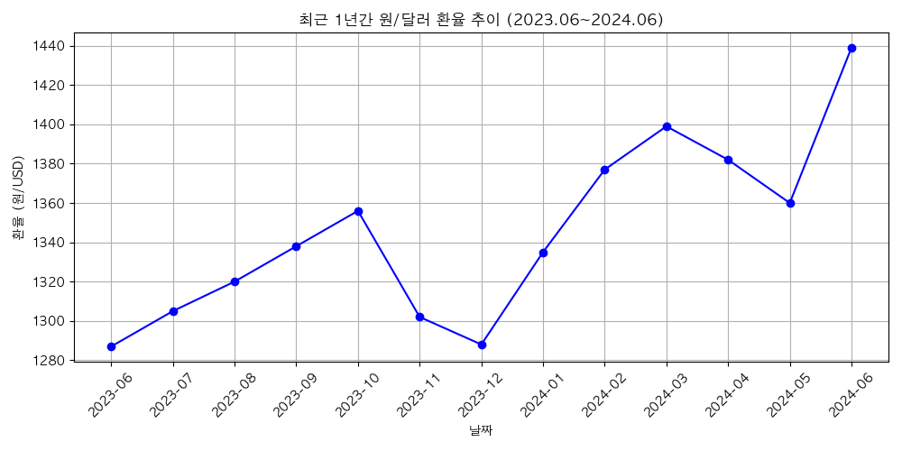

## 최근 1년간 원/달러 환율 추이 분석 (2023.06 ~ 2024.06)

### 데이터 요약
- 기간: 2023년 6월 ~ 2024년 6월 (13개월)
- 최고 환율: 2024년 6월, 1,439원/USD
- 최저 환율: 2023년 6월, 1,287원/USD

### 주요 특징 및 해석
- 구간 초반(2023년 하반기)에는 소폭 상승/하락이 반복되며 대체로 1,300~1,350원대에서 등락.
- 2023년 11월과 12월에는 환율이 하락세(1,302→1,288)로 진입.
- 2024년 1월 이후 뚜렷한 상승세가 관찰됨: 2024년 2월 1,377원, 2024년 3월 1,399원 기록.
- 2024년 6월에 최고점인 1,439원을 기록하며, 최근 한 달 사이 급격한 상승.

### 결론
최근 1년 동안 원/달러 환율은 변동성이 비교적 높은 흐름을 보였습니다. 특히 2024년 상반기 이후 뚜렷한 상승세가 감지되며, 거시경제적 변수(미국 금리, 글로벌 경기 등)와 관련하여 환율 리스크에 주의가 필요한 시점으로 판단됩니다.
