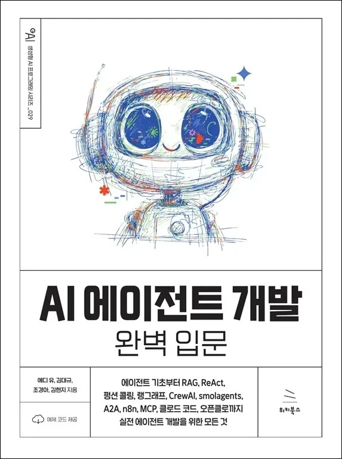

# AI 에이전트 개발 완벽 입문
### 에이전트 기초부터 RAG, ReAct, 펑션 콜링, 랭그래프, CrewAI, smolagents, A2A, n8n, MCP, 클로드 코드, 오픈클로까지 실전 에이전트 개발을 위한 모든 것

- **에디 유, 김대규, 조경아, 김현지** 지음
- ISBN: 9791158396756
- 판형: 175\*235\*30mm
- 42,000원 | 2026년 4월 28일 발행 | 732쪽
- [책 홈페이지](https://wikibook.co.kr/ai-agents-dev/)
- [도서 미리보기](http://www.yes24.com/Product/Viewer/Preview/186921504)
- [도서 관련 문의](https://wikibook.co.kr/support/contact/)

---

**AI 에이전트 시대를 준비하는 가장 실용적인 안내서!**

이 책은 AI에 입문하고자 하는 누구나 손쉽게 AI 에이전트의 세계에 자연스럽게 발을 들일 수 있도록 구성했습니다. 단순히 사용법을 따라 하는 데 그치지 않고, RAG, 펑션 콜링, 랭그래프, CrewAI, smolagents의 동작 원리를 이해하는 데 필요한 기초 지식부터 충실히 다루고 있습니다. 또한 MCP와 A2A를 활용한 에이전트 연동, n8n을 활용한 노코드 자동화, 클로드 코드 기반의 바이브 코딩, 오픈클로를 이용한 자율형 AI 비서 구축까지, 지금 현장에서 실제로 쓰이는 기술들을 하나의 흐름으로 익힐 수 있습니다. 이 책을 읽고 나면 여러분이 원하는 AI 에이전트를 스스로 설계하고 구현할 수 있을 것입니다.

**★ 이 책에서 다루는 내용 ★**

- AI 에이전트의 기초 및 에이전트 시스템 구축 패턴
- 랭체인을 활용한 검색 증강 생성(RAG) 구현
- ReAct와 펑션 콜링 에이전트
- 랭그래프를 활용한 에이전트 워크플로우 설계
- CrewAI를 통한 에이전트 협업 구조 구축
- smolagents를 활용한 에이전트 구축
- A2A(Agent-to-Agent) 프로토콜
- n8n을 이용한 워크플로우 자동화
- MCP(Model Context Protocol)
- 클로드 코드를 활용한 바이브 코딩
- 오픈클로를 이용한 AI 비서 만들기
 
---
 
 ## 구입처
 
 - [예스24](https://www.yes24.com/product/goods/186921504)
 - [교보문고](https://product.kyobobook.co.kr/detail/S000219725405)
 - [알라딘](https://www.aladin.co.kr/shop/wproduct.aspx?ItemId=390789073)
